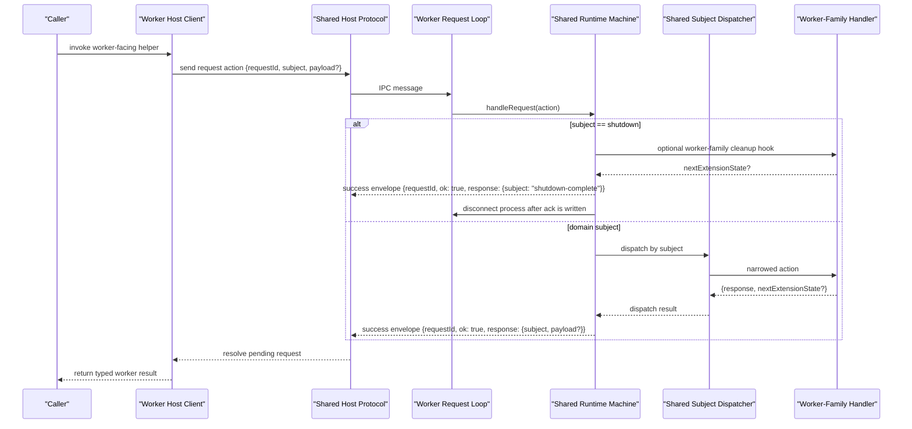
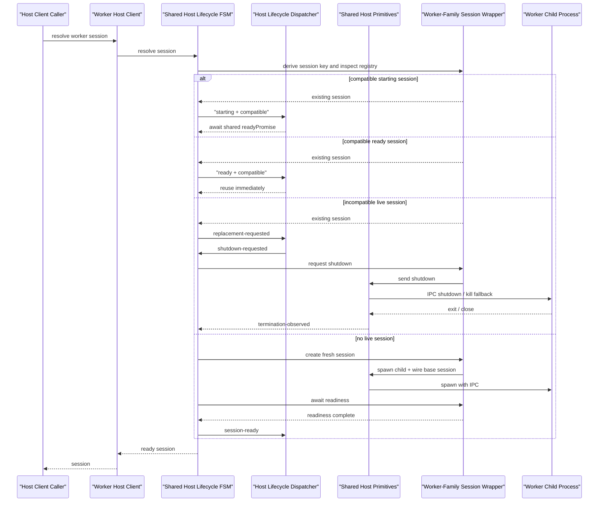

# Workers

This note describes the worker families used by the current Next integration.

The goal is to make two boundaries explicit:

1. the dev-only proxy worker
2. the App-only page-data compiler worker

## High-Level Matrix

| Worker                        | Purpose                                                                                           | Routers     | Trigger                                                                                          | Dev | Build                                                   | Prod runtime                               | Startup prewarm |
| ----------------------------- | ------------------------------------------------------------------------------------------------- | ----------- | ------------------------------------------------------------------------------------------------ | --- | ------------------------------------------------------- | ------------------------------------------ | --------------- |
| Proxy worker                  | Request-time heavy/light routing, lazy single-route analysis, and one-file emission in proxy mode | Pages + App | First proxied request, or startup prewarm when `app.routing.workerPrewarm === 'instrumentation'` | yes | no                                                      | no                                         | optional        |
| App page-data compiler worker | Run the app-owned page-data compiler selected by `handlerBinding.pageDataCompilerImport`          | App only    | `runAppPageDataCompiler({ targetId, input })`                                                    | yes | yes, when route execution calls the helper during build | yes, when route execution calls the helper | no              |

## Shared Runtime Machine

Both live worker families now sit on the same shared runtime shell.

That shared shell owns:

- the `subject + payload` worker action protocol
- the request/response envelope shape
- the runtime finite state machine
- the typed dispatcher for non-shutdown domain subjects
- the standard shutdown flow

The shared runtime machine is intentionally narrow. It owns only the lifecycle
and transport-adjacent control path:

- phase `running`
- phase `shutting-down`
- phase `closed`
- shared control request `shutdown`
- shared control response `shutdown-complete`

Each concrete worker family still owns:

- its retained extension state
- its domain subjects
- its domain handler implementations
- any worker-family-specific shutdown cleanup

In practice that means:

- the proxy worker owns bootstrap state plus subjects like `bootstrap` and `resolve-lazy-miss`
- the App page-data worker owns `compile-page-data`
- App static-param filtering is handled inline in `src/next/app/static-params.ts`

### Protocol shape

Requests sent into a worker session use:

```ts
{
  requestId: string;
  subject: string;
  payload?: unknown;
}
```

Successful worker responses use:

```ts
{
  subject: string;
  payload?: unknown;
}
```

Those actions still travel inside the normal shared response envelope:

```ts
{
  requestId: string;
  ok: true;
  response: { subject, payload? };
}
```

or:

```ts
{
  requestId: string;
  ok: false;
  error: {
    message: string;
  }
}
```

`payload` is used only when the action actually carries business data.
Control actions like `shutdown` and `shutdown-complete` omit it.

### Request flow

One worker request now moves through these layers in order:

1. the host/client module creates `{ requestId, subject, payload }`
2. the shared host protocol sends it over Node IPC and tracks the pending request
3. the worker process request loop accepts the raw IPC message
4. the shared runtime machine checks the current phase
5. if the subject is `shutdown`, the machine runs the shared shutdown path
6. otherwise, the shared dispatcher routes the subject to the concrete worker-family handler
7. the worker-family handler returns `{ response, nextExtensionState? }`
8. the shared runtime protocol writes the success or error envelope
9. the shared host protocol resolves the original pending request

The important ownership boundary is:

- shared code decides whether the request is allowed and how shutdown works
- concrete worker code decides what `bootstrap`, `resolve-lazy-miss`, or
  `compile-page-data` actually do

### Sequence diagram



### Relevant shared files

1. `src/next/shared/worker/types.ts`
2. `src/next/shared/worker/runtime/protocol.ts`
3. `src/next/shared/worker/runtime/dispatcher.ts`
4. `src/next/shared/worker/runtime/machine.ts`
5. `src/next/shared/worker/host/protocol.ts`

## Shared Host Lifecycle

The parent-process side now has its own shared layer too.

That layer sits above the low-level `host/` transport primitives and below the
concrete worker-family clients:

- `src/next/shared/worker/host`
  - low-level host primitives
  - pending request tracking
  - IPC response-envelope routing and settlement
  - raw child-process session creation/finalization helpers
- `src/next/shared/worker/host-lifecycle`
  - higher-level host session policy
  - parent-process session finite state machine
  - internal `subject + payload` lifecycle events
  - session phases
  - shared `readyPromise` handling
  - reuse versus replace decisions
  - graceful shutdown orchestration

This keeps the layering parallel to the runtime side:

- runtime owns the worker-process finite state machine
- host-lifecycle owns the parent-process session lifecycle policy

### What the host-lifecycle layer owns

The shared host-lifecycle layer is intentionally host-oriented.

It owns:

- host session phase tracking:
  - `starting`
  - `ready`
  - `shutting-down`
  - `failed`
  - `closed`
- overlapping session-readiness dedupe in the parent process
- the common "reuse, replace, or create" resolution flow
- shared graceful shutdown orchestration with:
  - shutdown request send
  - acknowledgement timeout fallback
  - termination wait
  - idempotent repeated shutdown callers

It does not own:

- low-level IPC transport writes
- low-level response-envelope routing and settlement
- worker-process runtime dispatch
- worker-family compatibility rules
- worker-family spawn args, cwd, env, or logging

### Worker-family extension points

Each concrete worker family still supplies the host-lifecycle extension points:

- how to derive the stable session key
- how to create a fresh session
- what makes an existing session reusable
- how to await readiness
- how to shut down or replace an incompatible session
- worker-family-specific logging around those flows

In practice:

- the proxy worker extends the shared host-lifecycle layer with bootstrap
  generation compatibility and bootstrap readiness
- the App page-data worker uses the same host-lifecycle layer with simple
  root-based reuse
- there is no separate build worker anymore; App static-param filtering stays
  in the direct App path

### Host-side flow

One host-side "ensure the session is ready" call now moves through a real
parent-process session FSM:

1. the worker-family host client asks for a session
2. the shared host-lifecycle machine derives the stable session key
3. it looks up the currently registered session
4. if the session is `starting` and still compatible, the caller awaits that
   session's shared `readyPromise`
5. if the session is `ready` and compatible, the caller reuses it immediately
6. if the session is incompatible, the machine emits replacement and shutdown
   events, waits for termination, then creates the next session
7. for a new session, the machine creates and registers a fresh host-managed
   session in `starting`
8. it awaits worker-family readiness, such as proxy bootstrap
9. it emits `session-ready`, resolves the shared `readyPromise`, and returns
   the session to the caller

The important shift is that startup overlap is now handled by:

- registry lookup
- explicit host session phases
- one shared `readyPromise`

instead of worker-family-specific in-flight session-resolution maps.

### Host sequence diagram



### Relevant shared files

1. `src/next/shared/worker/host/session-lifecycle.ts`
2. `src/next/shared/worker/host-lifecycle/types.ts`
3. `src/next/shared/worker/host-lifecycle/session.ts`
4. `src/next/shared/worker/host-lifecycle/dispatcher.ts`
5. `src/next/shared/worker/host-lifecycle/machine/index.ts`
6. `src/next/shared/worker/host-lifecycle/machine/internal/`

## Proxy Worker

The proxy worker is the dev-only worker family used by the request-time proxy
path.

Its responsibilities are:

- resolve proxy bootstrap state
- classify heavy versus light ownership at request time
- run lazy single-route analysis on cache misses
- coordinate one-file generated-handler emission when development discovers a
  new heavy route

It is not the App page-data compiler worker, and it does not compile page
props.

This worker applies only when development routing uses proxy mode. Rewrite
mode does not use it, and production runtime does not use it.

### Startup prewarm

`app.routing.workerPrewarm: 'instrumentation'` applies only to the proxy
worker.

When enabled, the integration generates a tiny root `instrumentation.ts`
bridge that asks the library to create or reuse the current proxy worker
session during Next startup.

That startup prewarm is intentionally narrow:

- it creates or reuses the worker session
- it does not classify pathnames
- it does not emit handlers
- it does not warm App page-data compilation

Relevant files:

1. `src/next/proxy/runtime/prewarm.ts`
2. `src/next/proxy/instrumentation/file-lifecycle.ts`
3. `src/next/proxy/worker/host/client.ts`
4. `src/next/proxy/worker/runtime/entry.ts`

## App Page-Data Compiler Worker

The App page-data compiler worker is a separate worker family used only by the
App Router path.

Its job is narrow:

- receive `targetId` plus a serializable input payload
- resolve the persisted compiler module path for that App target
- import the app-owned compiler module
- run `pageDataCompiler.compile({ targetId, input })`
- return the serializable result back to the route contract

This worker exists because the App route contract may need build-only tooling
for page-data preparation without pulling that tooling into the App server
graph.

This worker is not tied to development mode. It applies whenever App route code
actually calls `runAppPageDataCompiler(...)`. That can happen:

- in development
- during build or static generation
- at runtime in production

The exact timing depends on when the App route executes and whether that route
contract chooses to call the helper.

There is no startup prewarm path for this worker today.

Relevant files:

1. `src/next/app/page-data-compiler-run.ts`
2. `src/next/app/lookup-persisted.ts`
3. `src/next/app/page-data-worker/host/client.ts`
4. `src/next/app/page-data-worker/runtime/entry.ts`

## Demo Note

Both demos now enable proxy-worker startup prewarm in their stable
`route-handlers-config.ts` selector:

- `demo/page-router/route-handlers-config.ts`
- `demo/app-router/route-handlers-config.ts`

That keeps the demos aligned and makes the first proxied request smoother in
development.

This does not prewarm the App page-data compiler worker. The App Router demo
still reaches that worker only when its route contract calls
`runAppPageDataCompiler(...)`.

## Practical Reading Guide

If you are tracing development proxy behavior, read these files in order:

1. `src/next/shared/config/routing-policy.ts`
2. `src/next/proxy/instrumentation/file-lifecycle.ts`
3. `src/next/proxy/runtime/prewarm.ts`
4. `src/next/proxy/worker/host/client.ts`
5. `src/next/proxy/worker/runtime/entry.ts`

If you are tracing App page-data compilation, read these files in order:

1. `demo/app-router/app/docs/[...slug]/route-contract.ts`
2. `src/next/app/page-data-compiler-run.ts`
3. `src/next/app/lookup-persisted.ts`
4. `src/next/app/page-data-worker/host/client.ts`
5. `src/next/app/page-data-worker/runtime/entry.ts`

If you are tracing App static-param filtering, read these files in order:

1. `src/next/app/static-params.ts`
2. `src/next/app/filter-static-params.ts`
3. `src/next/shared/heavy-route-lookup.ts`
